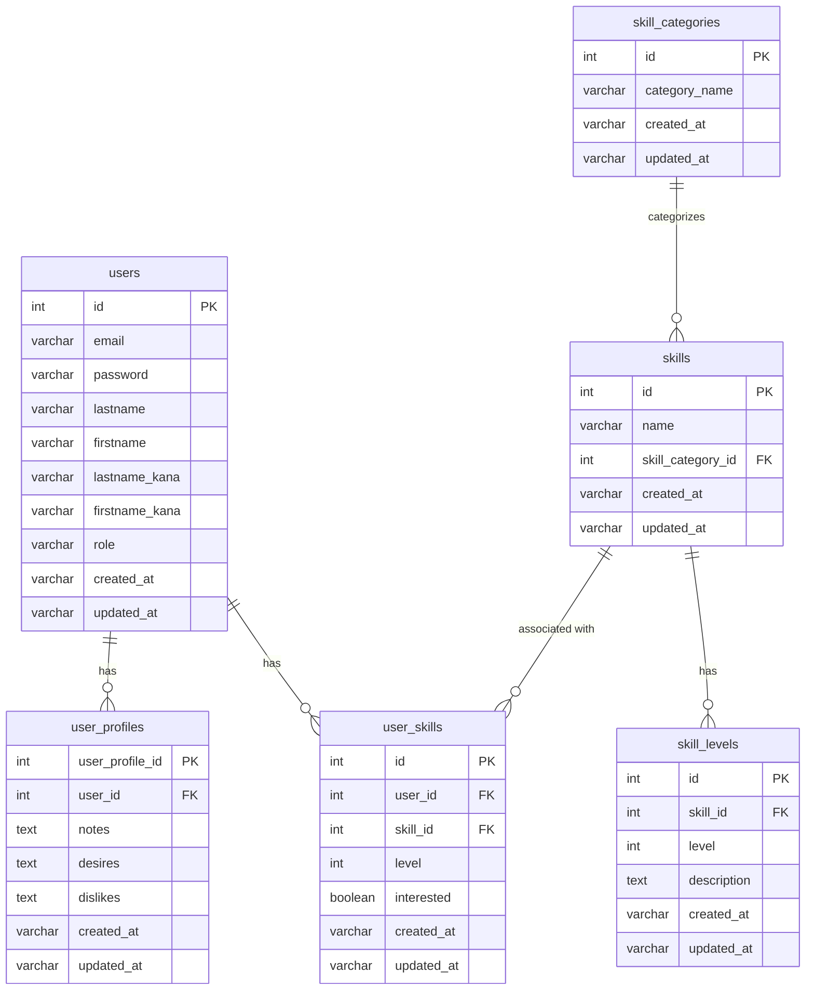

```mermaid
erDiagram
    users {
        int id PK
        varchar email
        varchar password
        varchar lastname
        varchar firstname
        varchar lastname_kana
        varchar firstname_kana
        varchar role
        varchar created_at
        varchar updated_at
    }

    skills {
        int id PK
        varchar name
        int skill_category_id FK
        varchar created_at
        varchar updated_at
    }

    skill_levels {
        int id PK
        int skill_id FK
        int level
        text description
        varchar created_at
        varchar updated_at
    }

    skill_categories {
        int id PK
        varchar category_name
        varchar created_at
        varchar updated_at
    }

    user_skills {
        int id PK
        int user_id FK
        int skill_id FK
        int level
        boolean interested
        varchar created_at
        varchar updated_at
    }

    user_profiles {
        int user_profile_id PK
        int user_id FK
        text notes
        text desires
        text dislikes
        varchar created_at
        varchar updated_at
    }

    users ||--o{ user_profiles : "has"
    users ||--o{ user_skills : "has"
    skills ||--o{ user_skills : "associated with"
    skill_categories ||--o{ skills : "categorizes"
    skills ||--o{ skill_levels : "has"

```
