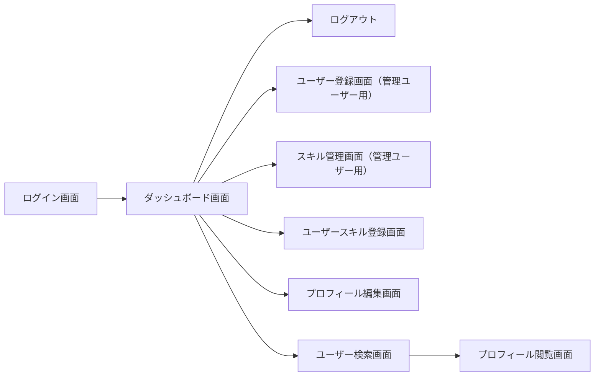

# 要件定義

## 概要

- 組織のメンバーのスキルを把握できるアプリメンバーは自身のスキルや希望のキャリアパスを登録したメンバーと共有できるスキルによるメンバー検索も可能
- 組織は各メンバーのスキルを把握することでアサインするプロジェクトのミスマッチを防ぐことが期待できますメンバー間の相互理解向上を見込めます
- プロジェクトさん各メンバーのスキルセットを把握することで、実績と乖離しがちな工数見積もりの精度向上に寄与

## 用語

| 用語           | 意味                                                                     |
| -------------- | ------------------------------------------------------------------------ |
| スキル         | UI 設計やサーバー構築などユーザーが保有する技能                          |
| スキルカテゴリ | スキルを分類するための枠組み                                             |
| ユーザー       | 当アプリを利用するユーザー                                               |
| 管理ユーザー   | スキルの作成やユーザーの登録ができるユーザー                             |
| 一般ユーザー   | 管理ユーザーの権限を持たないユーザー                                     |
| 権限           | 管理ユーザー、一般ユーザーなど各ユーザーに設定されたアプリ内での機能認可 |

## 機能要件

### ログイン/ログアウト機能

- 全てのユーザーはメールアドレス、パスワードを用いてログインできる
- ログアウトできる

### ユーザー登録機能

- 管理ユーザーはユーザーを登録できる
- 登録する際に、ユーザー名、メールアドレス、パスワード、権限を設定できる

### スキル作成/編集機能

- 管理ユーザーはユーザーが自身の保有技能として登録するスキルをマスタデータとして登録できる
- スキルはスキルカテゴリに結びついている
- 作成したスキルは習熟度や経験年数などにより段階のレベルに分けられ、スキル作成・編集時に各レベルの基準を設定できる

### スキル登録機能

- 全てのユーザーは、作成されたスキルに基づき自身の保有するスキルを５段階から選び登録できる
- また、興味があるスキルを選択できる

### ユーザー検索機能

- ユーザー名、保有スキル、保有スキルのレベル、スキルの興味などでユーザーを検索できる

### プロフィール閲覧機能

- 全てのユーザーのプロフィールを閲覧できる
- プロフィールには下記が含まれる

### プロフィール編集機能

- ログインユーザーのパスワード、保有スキルの補足、伸ばしていきたいスキルを編集できる
- 管理ユーザーは自身以外のユーザーのユーザー名、権限を編集できる

## 非機能要件

## 画面

## 画面一覧

| 画面名                 | 機能                                                                           | 要素                                                                                                                      | パス                 |
| ---------------------- | ------------------------------------------------------------------------------ | ------------------------------------------------------------------------------------------------------------------------- | -------------------- |
| ログイン画面           | ユーザーがメールアドレスとパスワードを入力してログインする画面                 | メールアドレス入力欄、パスワード入力欄、ログインボタン、パスワードリセットリンク                                          | `/login`             |
| ユーザー登録画面       | 管理ユーザーが新しいユーザーを登録する画面                                     | ユーザー名入力欄、メールアドレス入力欄、パスワード入力欄、権限選択（管理ユーザー/一般ユーザー）ドロップダウン、登録ボタン | `/admin/register`    |
| ダッシュボード画面     | ログイン後のトップページユーザー一覧を表示                                     | ユーザーの名前、スキル、プロフィール更新日                                                                                | `/`                  |
| スキル管理画面         | 管理ユーザーがスキルやスキルカテゴリを作成・編集する画面                       | スキルカテゴリの一覧、スキルの一覧、スキル追加/編集フォーム（スキル名、カテゴリ、レベル基準）、保存ボタン                 | `/admin/skills`      |
| ユーザースキル登録画面 | ユーザーが自身のスキルを登録・編集する画面                                     | スキル選択ドロップダウン、スキルレベル選択（1-5 段階）、興味選択チェックボックス、保存ボタン                              | `/user/skills`       |
| プロフィール編集画面   | ユーザーが自身のプロフィールを編集する画面                                     | ユーザー名入力欄、パスワード変更入力欄、保有スキルの補足説明入力欄、伸ばしていきたいスキル入力欄、保存ボタン              | `/user/profile/edit` |
| ユーザー検索画面       | ユーザー名、保有スキル、スキルレベル、スキルの興味などでユーザーを検索する画面 | 検索入力欄、検索フィルター（スキル、レベル、興味など）、検索結果リスト                                                    | `/search`            |
| ユーザー画面           | 他のユーザー情報を閲覧する画面                                                 | ユーザーの基本情報、保有スキルとそのレベル、興味のあるスキル、ノート、希望、嫌いなことの表示                              | `/user/{userId}`     |

## 画面遷移

## API エンドポイント

| エンドポイント          | メソッド | 概要                       |
| ----------------------- | -------- | -------------------------- |
| /hello                  | GET      | 疎通確認                   |
| /login                  | POST     | ユーザーログイン           |
| /logout                 | POST     | ユーザーログアウト         |
| /users/search           | POST     | 条件に基づいたユーザー検索 |
| /users/{userId}         | GET      | ユーザー取得               |
| /skills/{skillId}       | PUT      | 既存スキル編集             |
| /skills/categories      | GET      | 全スキルカテゴリ取得       |
| /users/{userId}/skills  | GET      | ユーザーのスキル取得       |
| /users/skills           | POST     | ユーザーのスキル登録・編集 |
| /users/{userId}/profile | GET      | ユーザープロフィール取得   |
| /users/{userId}/profile | PUT      | ユーザープロフィール編集   |
| /admin/users            | POST     | 新規ユーザー登録           |
| /admin/users/{userId}   | DELETE   | ユーザー削除               |
| /admin/skills           | POST     | 新規スキル作成             |
| /admin/skills/{skillId} | DELETE   | スキル削除 　              |
