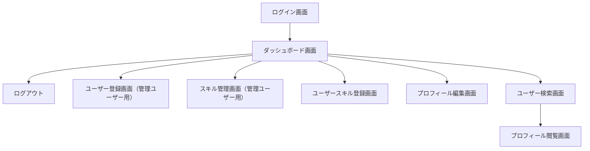

# 要件定義

## 概要

組織のメンバーのスキルを把握できるアプリ。メンバーは自身のスキルや希望のキャリアパスを登録したメンバーと共有できる。スキルによるメンバー検索も可能。
組織は各メンバーのスキルを把握することでアサインするプロジェクトのミスマッチを防ぐことが期待できます。メンバー間の相互理解向上を見込めます。

## 用語

| 用語           | 意味                                                                     |
| -------------- | ------------------------------------------------------------------------ |
| スキル         | UI 設計やサーバー構築などユーザーが保有する技能                          |
| スキルカテゴリ | スキルを分類するための枠組み                                             |
| ユーザー       | 当アプリを利用するユーザー                                               |
| 管理ユーザー   | スキルの作成やユーザーの登録ができるユーザー                             |
| 一般ユーザー   | 管理ユーザーの権限を持たないユーザー                                     |
| 権限           | 管理ユーザー、一般ユーザーなど各ユーザーに設定されたアプリ内での機能認可 |

## 機能要件

### ログイン/ログアウト機能

- 全てのユーザーはメールアドレス、パスワードを用いてログインできる
- またログアウトできる

### ユーザー登録機能

- 管理ユーザーはユーザーを登録できる
- 登録する際に、ユーザー名、メールアドレス、パスワード、権限を設定できる

### スキル作成/編集機能

- 管理ユーザーはユーザーが自身の保有技能として登録するスキルをマスタデータとして登録できる
- スキルはスキルカテゴリに結びついている
- 作成したスキルは習熟度や経験年数などにより段階のレベルに分けられ、スキル作成・編集時に各レベルの基準を設定できる

### スキル登録機能

- 全てのユーザーは、作成されたスキルに基づき自身の保有するスキルを５段階から選び登録できる
- また、興味があるスキルを選択できる

### ユーザー検索機能

- ユーザー名、保有スキル、保有スキルのレベル、スキルの興味などでユーザーを検索できる

### プロフィール閲覧機能

- 全てのユーザーのプロフィールを閲覧できる
- プロフィールには下記が含まれる

### プロフィール編集機能

- ログインユーザーのパスワード、保有スキルの補足、伸ばしていきたいスキルを編集できる
- 管理ユーザーは自身以外のユーザーのユーザー名、権限を編集できる

## 非機能要件

## 画面

### 1. ログイン画面

- **機能**: ユーザーがメールアドレスとパスワードを入力してログインする画面。
- **要素**: メールアドレス入力欄、パスワード入力欄、ログインボタン、パスワードリセットリンク。

### 2. ユーザー登録画面（管理ユーザー用）

- **機能**: 管理ユーザーが新しいユーザーを登録する画面。
- **要素**: ユーザー名入力欄、メールアドレス入力欄、パスワード入力欄、権限選択（管理ユーザー/一般ユーザー）ドロップダウン、登録ボタン。

### 3. ダッシュボード画面

- **機能**: ログイン後のトップページ。ユーザーのスキル情報やプロフィールの概要を表示。
- **要素**: ユーザーの基本情報、保有スキルの概要、興味のあるスキル、最近の活動フィード。

### 4. スキル管理画面（管理ユーザー用）

- **機能**: 管理ユーザーがスキルやスキルカテゴリを作成・編集する画面。
- **要素**: スキルカテゴリの一覧、スキルの一覧、スキル追加/編集フォーム（スキル名、カテゴリ、レベル基準）、保存ボタン。

### 5. ユーザースキル登録画面

- **機能**: ユーザーが自身のスキルを登録・編集する画面。
- **要素**: スキル選択ドロップダウン、スキルレベル選択（1-5 段階）、興味選択チェックボックス、保存ボタン。

### 6. プロフィール編集画面

- **機能**: ユーザーが自身のプロフィールを編集する画面。
- **要素**: ユーザー名入力欄、パスワード変更入力欄、保有スキルの補足説明入力欄、伸ばしていきたいスキル入力欄、保存ボタン。

### 7. ユーザー検索画面

- **機能**: ユーザー名、保有スキル、スキルレベル、スキルの興味などでユーザーを検索する画面。
- **要素**: 検索入力欄、検索フィルター（スキル、レベル、興味など）、検索結果リスト。

### 8. プロフィール閲覧画面

- **機能**: 他のユーザーのプロフィールを閲覧する画面。
- **要素**: ユーザーの基本情報、保有スキルとそのレベル、興味のあるスキル、ノート、希望、嫌いなことの表示。

### 9. ログアウト機能

- **機能**: ユーザーがログアウトするための機能。画面のヘッダー部分に配置。
- **要素**: ログアウトボタン。

## 画面遷移

## API エンドポイント

### 認証関連

1. **ログイン**

   - `POST /api/auth/login`
   - **説明**: メールアドレスとパスワードを使用してユーザーを認証し、トークンを発行します。

2. **ログアウト**

   - `POST /api/auth/logout`
   - **説明**: 現在のユーザーのセッションを終了します。

3. **ユーザー登録**
   - `POST /api/users`
   - **説明**: 新しいユーザーを登録します（管理ユーザーのみ）。

### ユーザー関連

4. **ユーザー情報取得**

   - `GET /api/users/{userId}`
   - **説明**: 特定のユーザーの情報を取得します。

5. **ユーザー情報更新**

   - `PUT /api/users/{userId}`
   - **説明**: 特定のユーザーの情報を更新します（管理ユーザーは他のユーザーの情報も更新可能）。

6. **ユーザー削除**
   - `DELETE /api/users/{userId}`
   - **説明**: 特定のユーザーを削除します（管理ユーザーのみ）。

### スキル関連

7. **スキル一覧取得**

   - `GET /api/skills`
   - **説明**: すべてのスキルを取得します。

8. **スキル作成**

   - `POST /api/skills`
   - **説明**: 新しいスキルを作成します（管理ユーザーのみ）。

9. **スキル更新**

   - `PUT /api/skills/{skillId}`
   - **説明**: 特定のスキルを更新します（管理ユーザーのみ）。

10. **スキル削除**
    - `DELETE /api/skills/{skillId}`
    - **説明**: 特定のスキルを削除します（管理ユーザーのみ）。

### スキルカテゴリ関連

11. **スキルカテゴリ一覧取得**

    - `GET /api/skill-categories`
    - **説明**: すべてのスキルカテゴリを取得します。

12. **スキルカテゴリ作成**

    - `POST /api/skill-categories`
    - **説明**: 新しいスキルカテゴリを作成します（管理ユーザーのみ）。

13. **スキルカテゴリ更新**

    - `PUT /api/skill-categories/{categoryId}`
    - **説明**: 特定のスキルカテゴリを更新します（管理ユーザーのみ）。

14. **スキルカテゴリ削除**
    - `DELETE /api/skill-categories/{categoryId}`
    - **説明**: 特定のスキルカテゴリを削除します（管理ユーザーのみ）。

### ユーザースキル関連

15. **ユーザースキル取得**

    - `GET /api/users/{userId}/skills`
    - **説明**: 特定のユーザーが保有するスキルの一覧を取得します。

16. **ユーザースキル登録**

    - `POST /api/users/{userId}/skills`
    - **説明**: 特定のユーザーにスキルを登録します。

17. **ユーザースキル更新**

    - `PUT /api/users/{userId}/skills/{userSkillId}`
    - **説明**: 特定のユーザーのスキル情報を更新します。

18. **ユーザースキル削除**
    - `DELETE /api/users/{userId}/skills/{userSkillId}`
    - **説明**: 特定のユーザーのスキル情報を削除します。

### プロフィール関連

19. **プロフィール取得**

    - `GET /api/users/{userId}/profile`
    - **説明**: 特定のユーザーのプロフィールを取得します。

20. **プロフィール更新**
    - `PUT /api/users/{userId}/profile`
    - **説明**: 特定のユーザーのプロフィールを更新します。

### ユーザー検索

21. **ユーザー検索**
    - `GET /api/users/search`
    - **説明**: ユーザー名、保有スキル、スキルレベル、興味などでユーザーを検索します。
    - **パラメータ**: `name`, `skill`, `level`, `interest`
