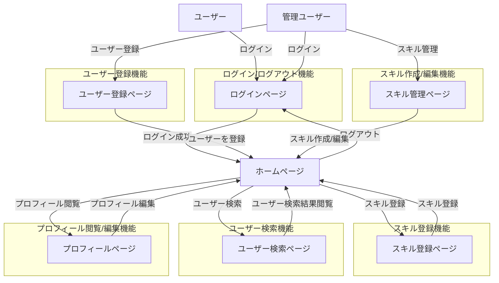

# 業務フロー

## ログイン/ログアウト機能

1. **ユーザー**
   - ログインページからメールアドレスとパスワードを入力してログインする
   - ログイン成功後、ホームページに遷移する
   - ヘッダーからログアウトする

## ユーザー登録機能

1. **管理ユーザー**
   - ユーザー登録ページから新規ユーザーを登録する
   - 登録時に、ユーザー名、メールアドレス、パスワード、権限を設定する
   - 登録完了後、入力フォームがクリアされる

## スキル作成/編集機能

1. **管理ユーザー**
   - スキル管理ページから新規スキルを作成または既存スキルを編集する
   - スキルはスキルカテゴリに結びつけられる
   - 各スキルの習熟度や経験年数などのレベル基準を設定する

## スキル登録機能

1. **全てのユーザー**
   - スキル登録ページから自身の保有スキルを 5 段階で選択し登録する
   - また、興味のあるスキルを選択することもできる

## ユーザー検索機能

1. **全てのユーザー**
   - ユーザー検索ページからユーザー名、保有スキル、保有スキルのレベル、スキルの興味などで他のユーザーを検索する
   - 検索結果を閲覧する

## プロフィール閲覧機能

1. **全てのユーザー**
   - プロフィールページから全てのユーザーのプロフィールを閲覧する
   - プロフィールにはユーザーの基本情報、保有スキル、スキルレベル、興味スキルなどが含まれる

## プロフィール編集機能

1. **ログインユーザー**
   - プロフィールページから自身のパスワード、保有スキルの補足、伸ばしていきたいスキルを編集する
2. **管理ユーザー**
   - プロフィールページから自身以外のユーザーのユーザー名、権限を編集する
